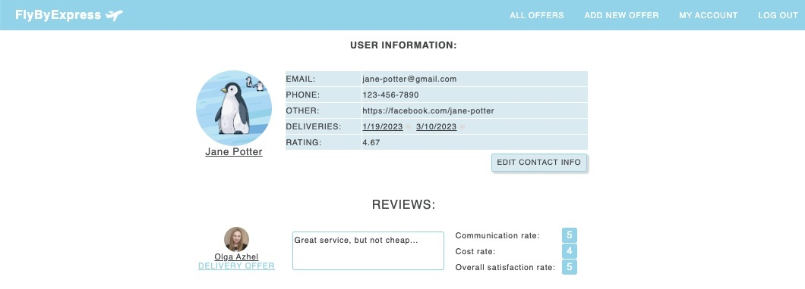

## FlyByExpress 
FlyByExpress is an application for vewing and posting advertisements for shipping packages by individuals. The app is created to help members of Belarussian immigrants community in the US to connect with people who are flying to their home country and are willing to deliver packages and gifts to Belarus. The application provides a space, where a user can publish an offer for package delivery and other users can choose from the list of current offers and connect with the the courier.

### Screenshots

## 👀 Take a look at FlyByExpress [HERE](https://fly-by-express.herokuapp.com/)

## Technologies Used

## Next spets:
implement possibility to save offers in user's collection for easier future reference, implement review validation,so only users who actually used services could leave reviews.